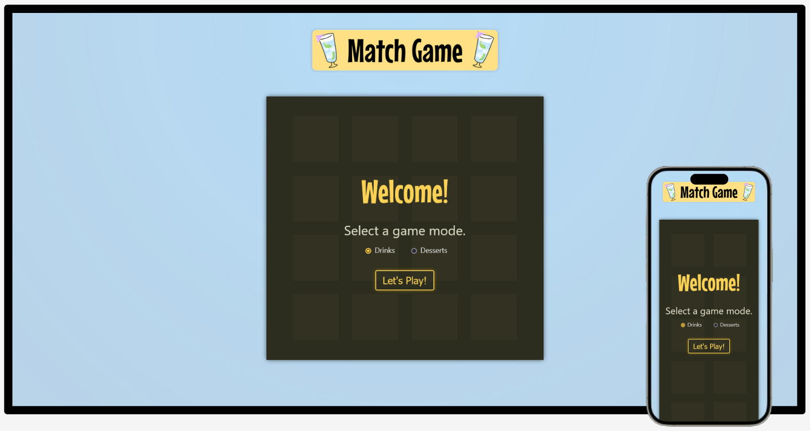
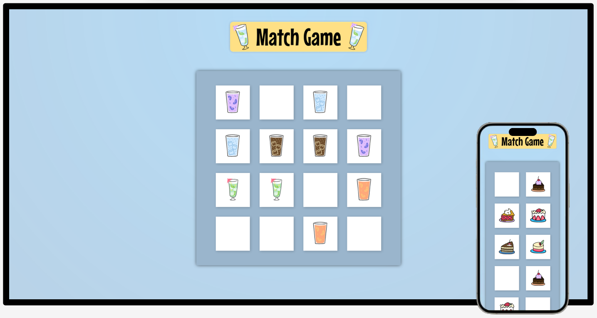
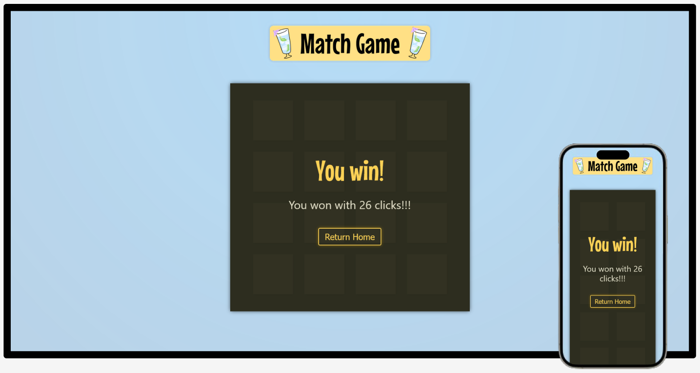

# Match Game

This memory match game builds a 4x4 grid and challenges the user to find all eight matching pairs to win. Clicking individual cards reveals their images, with two images being compared at a time. The goal is to win with the least number of clicks.

## Table of contents

- [Overview](#overview)
  - [The Goal](#the-goal)
  - [Screenshots](#screenshots)
  - [Game Link](#game-link)
- [My process](#my-process)
  - [Built with](#built-with)
  - [Continued Development](#continued-development)
  - [Useful Resources](#useful-resources)
- [Author](#author)

## Overview

### The Goal

Users should be able to:

- Choose a game mode (either drinks or desserts) before starting the game.
- Reveal a card's image when the card is clicked.
- See previous matches while continuing to match remaining cards.
- Be presented with a count summary and an option to play after matching all pairs.
- See hover and focus states for all interactive elements on the page.

### Screenshots

### Game Link
- Live Site URL: [Match Game](https://mjclaypool.github.io/Match-Game/)

## My process

### Built with

- HTML5
- CSS3
- JavaScript
- React

### Continued Development

Since some of the drink images are identical aside from a color change, I plan to add card titles below the images for improved accessibility.

### Useful Resources
- [Udemy: React - The Complete Guide 2024](https://www.udemy.com/course/react-the-complete-guide-incl-redux/) - This React course by Maximilian Schwarzmuller, specifically the Tic-Tac-Toe project, inspired me to try building my own game with React. This course provides many hands-on learning opportunities and emphasizes React best practices early and often.

- [Blush: The Munchies](https://blush.design/collections/the-munchies/the-munchies) - This collection of food and drink illustrations by Elsma Ramirez was used for the game's card images. There are many more, similarly-styled illustrations in this collection that could be used to expand the game with additional categories and/or difficulty levels.

## Author

- [@mjclaypool](https://github.com/mjclaypool)